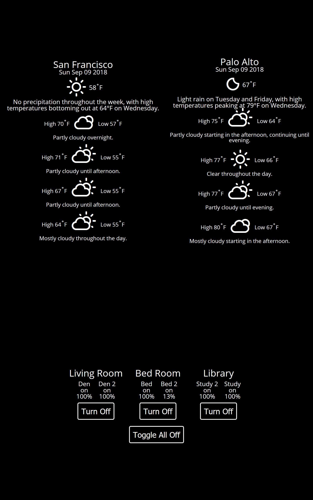

# Home Panel

## Introduction

As much as I love my hue lights, I've discovered they are frequently almost completely alien to my family when they visit. To have someone switch context from hitting a switch to opening their phone, selecting an app, and turning it off is hard. I figured building a nice app to run on an Amazon Fire tablet would be the way to go.

## Initial Concept

I've seen a lot of those home panels on reddit and various other programming social haunts, and while I like the idea they all seem to be magic mirrors and don't really add any benefit to my day to day. I spent some time talking with my wife about how to make our visiting older relatives more able to use the lights.

## Work

There are a few things that are tricky here:

  * Interacting with hue api
  * Getting light status
  * Making the weather api easy to configure
  * Making the code something worth looking at

The hue api is fairly straight forward. You first authenticate, get a new user token, and then use that to do some CRUD operations to control them. It also has some nice information about the in home lights so it can be easy to identify which lights are in which rooms.

The weather api is from dark sky, and I really like it. I'm using a set of weather icons, and via styled components, I'm programatically choosing the correct ones based on the returned status from the api. I will break this package out separately soon for consumption. All in all the weather api was nice and easy to use, and looks pretty alright.

## Final Thoughts

While this was supposed to be a quick project, I found myself sinking significantly more time into it that I expected. To get an application properly using Redux, React, Styled Components, and performing CRUD operations takes a lot longer than a few hours. At the end I'm very happy with the output, and would be stoked to find out who's using it.

Check it out [here](https://github.com/hweeks/home-panel).
